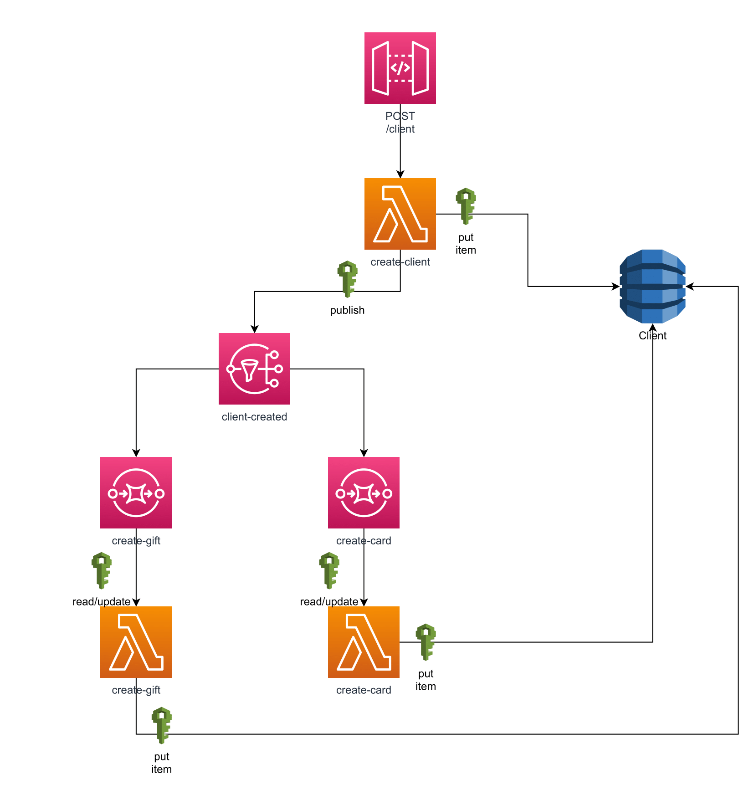

# naranjax-sls
Crear el yml necesario para el Ejercicio de AWS práctico y deployarlo. En caso de no tenerlo hecho tomar como punto de partida el siguiente proyecto y su respectivo esquema

El nombre del service tendrá la siguiente convención [nombreApellido]-[nombreDelServicio] (ej: johnFoo-ejercicioSls).

Aquí si vamos a incluir API Gateway, la cuenta que usaremos es `trainings-nonprod` en `us-east-1`.

Para poder deployar tendremos que copiar nuestras credenciales de la cuenta de AWS en nuestro archivo local de credentials en la carpeta .aws, entrando a AWS SSO desde MyApps, luego en `trainings-nonprod`, en Command line or programmatic access y finalmente copiamos lo que figura en opción 2, recomendamos reemplazar lo que sale entre corchetes por default para no tener inconvenientes en nuestras pruebas.

Luego de deployar nuestro stack, tener en cuenta realizar el correcto API Mapping como se explica en API Gateway para poder obtener la url base.